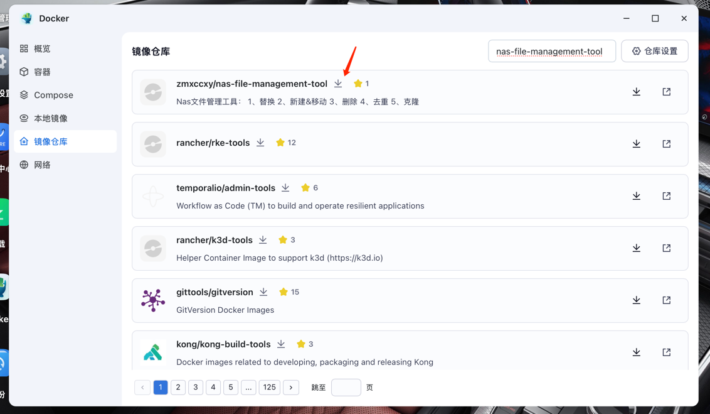
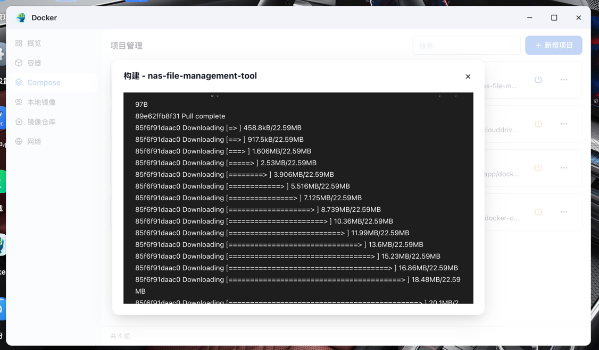

# NAS 文件管理工具功能说明

## 功能列表

### 1. 替换
- **功能描述**：批量替换文件名中的内容。
- **应用场景**：快速调整文件命名规则，解决文件名中存在错误或格式不统一的问题。

---

### 2. 新建 & 移动
- **功能描述**：根据文件名创建文件夹，并将文件移动到对应文件夹中。
- **应用场景**：整理文件时，自动化将文件分类到各自的目录下，提升文件管理效率。

---

### 3. 删除
- **功能描述**：支持删除文件和文件夹，特别是删除无视频资源的空文件夹。
- **应用场景**：清理 NAS 存储中的冗余文件或文件夹，节省存储空间。

---

### 4. 去重
- **功能描述**：检测并查询重复文件，方便用户手动清理或进一步操作。
- **应用场景**：避免存储中存在多份重复文件，减少资源浪费。

---

### 5. 克隆（暂未实现）
- **功能描述**：克隆目录结构而不复制文件内容。
- **应用场景**：用于批量创建与原有目录一致的目录结构，便于新文件的存放与组织。

---

## 待实现功能
- **目录结构克隆**：该功能计划中，后续实现后可支持更高效的文件组织管理。

---

## 安装和使用
- **Docker-Compose（推荐）**

    配置好挂载目录（可以多个）

```yaml
version: "2.1" # 使用 Docker Compose 文件的版本。

services:
  nas_file_management_tool: # 服务名称
    image: zmxccxy/nas-file-management-tool:latest # 使用的镜像名称及版本
    container_name: nas_file_tool # 指定容器名称，容器将被命名为 nas_file_tool

    environment: # 环境变量配置
      - TZ=Asia/Shanghai # 设置容器内的时区为上海（东八区）
      - DATA_DIR=/nas-fmt # 指定应用数据目录，供工具管理文件时使用

    volumes: # 挂载主机目录到容器，用于持久化数据或共享文件
      - 《你主机需要进行管理的文杰目录》:/data # 将主机中的某个目录挂载到容器的 /data 目录，作为文件管理的目标目录

    ports:
      - "6996:6996" # 将主机的 6996 端口映射到容器的 6996 端口，便于访问 Web 界面

    devices:
      - /dev/fuse:/dev/fuse # 授权容器访问主机的 /dev/fuse，用于文件操作或挂载功能（如果工具需要）

    restart: unless-stopped # 设置容器的重启策略，除非手动停止，否则在故障后自动重启

    pid: "host" # 共享主机的 PID 命名空间，允许容器访问主机进程信息

    privileged: true # 以特权模式运行容器，适用于需要更高权限的文件管理操作

    #network_mode: "host" # 使用主机网络模式，容器直接共享主机网络
```
如果拉取不下来，可以配置在/etc/docker/daemon.json中配置加速器，以下是在网上找的，配置后可以能拉取下。在编辑器不方便修改，可以把里面的内容复制出来，在外面修改好后再粘贴回去。

```json
{
    "registry-mirrors": [
        "https://docker.ketches.cn",
        "https://hub.geekery.cn",
        "https://hub.littlediary.cn",
        "https://docker.rainbond.cc",
        "https://docker.unsee.tech",
        "https://docker.m.daocloud.io",
        "https://hub.crdz.gq",
        "https://docker.nastool.de",
        "https://hub.firefly.store",
        "https://registry.dockermirror.com",
        "https://docker.1panelproxy.com",
        "https://hub.rat.dev",
        "https://docker.udayun.com",
        "https://docker.kejilion.pro",
        "https://dhub.kubesre.xyz",
        "https://docker.1panel.live",
        "https://dockerpull.org",
        "https://docker.hlmirror.com",
        "https://registry.docker-cn.com",
        "https://mirror.ghcr.io",
        "https://docker.mirrors.tuna.tsinghua.edu.cn"
    ]
}
```


